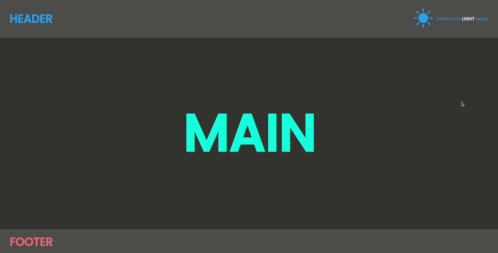
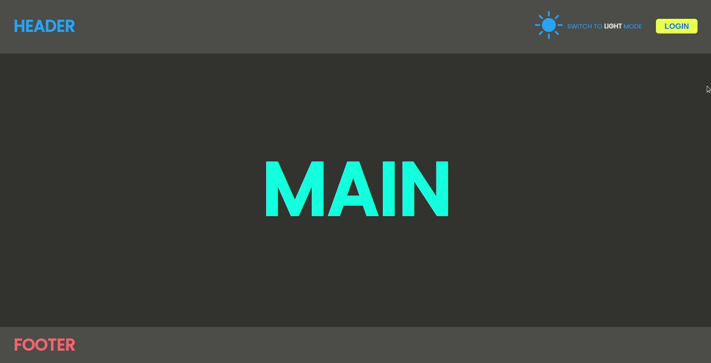

# :cartwheeling: Exercise Context API

---
### Task

- Create a Basic React App, with a theme toggle to let the user choose between dark and light mode. 

- if the user changes the theme, your components styles (`color` and `backgroundColor`) should be updated accordingly
Please solve the exercise by using `useContext`.

---

**structure your app as follows:**

- `App` has Header, Main and Footer as children
  - `Header`
  - `Main`
  - `Footer`

- `Header` has ThemeSwitch as a child:
  - `ThemeSwitch` 

---

### Bonus :weight_lifting:

- add a `Login` Component as a child of `Header`

 - `Header` has now ThemeSwitch and Login as children:
   - `ThemeSwitch` 
   - `Login`

- change the text of main according to the login state
 
Please solve by using `useContext` again.

